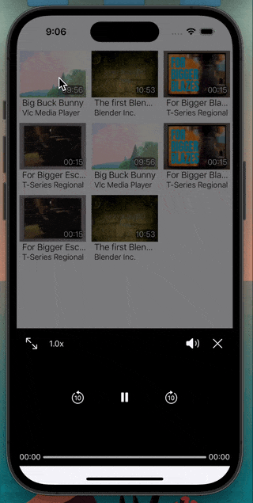

## Видеоплеер

### Стек технологий: Swift, UIKit, верстка кодом, VIPER, Clean Architecture, async/await

  

<h2> Функции </h2>

+ [x]  ***Загрузка видео из JSON***

+ [x]  ***Отображение видео в виде коллекции***

+ [x] ***Воспроизведение видео с кастомными контролами*** 

+ [x] ***Добавление аналитики Firebase*** 

+ [x] ***Добавление Crashlitics Firebase***

+ [x] ***Добавление Remote Сonfig***

+ [x] ***Реализация bottom sheet без использования сторонних либов***

+ [x] ***Дебаг панель для тестирования (вызов путем тряски)***

